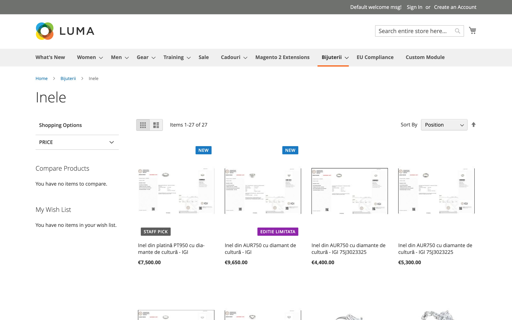
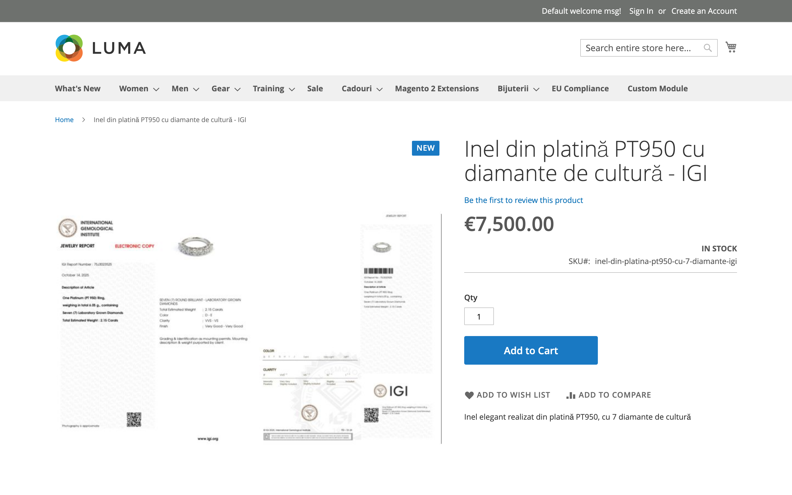
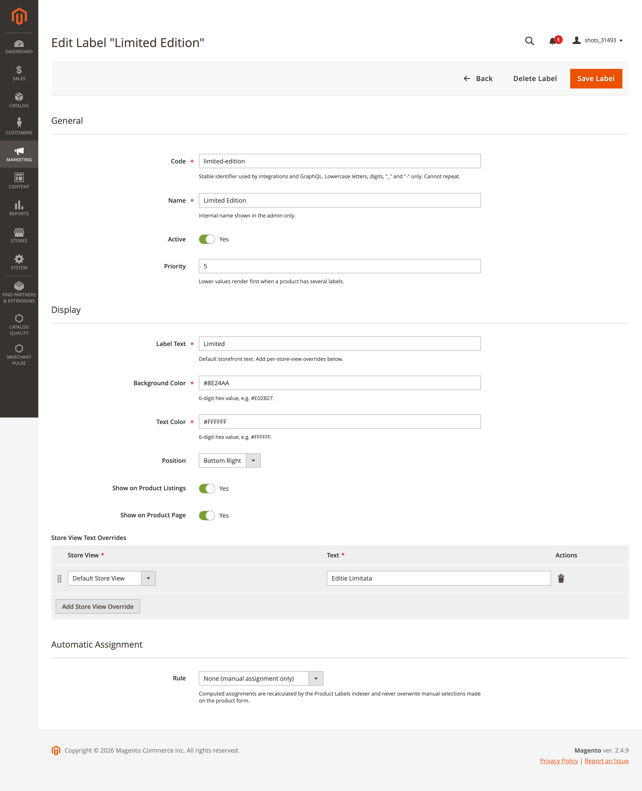
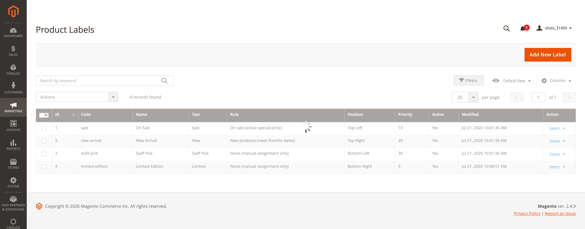

# Magendoo ProductLabels

Product labels ("Sale", "New", "Staff Pick", …) for Magento 2.4.x, rendered as badges on category
listings and product pages, exposed in GraphQL, and driven by a first-class label entity with a
stable code — not by ad-hoc attribute options.



## Why this module is shaped the way it is

- **Labels are entities, not attribute options.** Every label has a stable `code`
  (e.g. `sale`, `new-arrival`) that stays identical across environments and is the only
  identifier integrations should use. Numeric IDs are local to one installation.
- **Manual and computed assignments never share storage.** Merchandisers assign labels on the
  product form (a multiselect attribute the module never writes). Rule-computed assignments are
  materialized by an indexer into a dedicated table. A rule recalculation can never overwrite a
  merchandiser's selection, and a product import can never wipe computed labels.
- **The storefront reads materialized data only.** Category and search listings are preloaded in
  one batch — two indexed lookups for the whole page, no rule evaluation, no external calls in
  the render path. Related/up-sell blocks and product widgets fall back to two lookups per tile
  (batched preload for those surfaces is on the roadmap).

## Features

- Label definitions with admin grid and form: code, name, text, colors, corner position,
  per-placement visibility (listing / product page), priority, active flag.
- Store-view text overrides (e.g. translate "Sale" per store view).
- Manual assignment via the **Product Labels** multiselect on the product form
  (Product Details section, global scope).
- Two built-in computed rules, recalculated by a real Magento indexer with MView change tracking:
  - **New products** — the product's *Set Product as New From/To* window is active.
  - **On sale** — the product has an active special price window and the special price is below
    the regular price.
- Luma rendering on category listings, search results and product pages (badge overlay,
  four corner positions, stacked when several labels share a corner).
- GraphQL: `magendoo_labels` on every product in the `products` query.
- Full-page-cache aware: pages carry identity tags for the labels they render, listing pages are
  stamped with every label so visibility transitions flush in both directions, manual assignees'
  product pages are flushed when a label's visibility changes, and the indexer flushes exactly
  the products whose computed label set changed.

| Product page | Admin form |
|---|---|
|  |  |

## Requirements

- Magento Open Source / Adobe Commerce 2.4.x (`magento/framework` ≥ 103)
- PHP 8.2, 8.3 or 8.4

## Installation

```bash
# from the Magento root
composer require magendoo/module-product-labels     # once published on Packagist

# or manually: copy the module to app/code/Magendoo/ProductLabels, then
bin/magento module:enable Magendoo_ProductLabels
bin/magento setup:upgrade
bin/magento cache:flush
```

The `setup:upgrade` creates three tables (`magendoo_product_label`,
`magendoo_product_label_store`, `magendoo_product_label_assignment`), the
`magendoo_product_labels` product attribute, and registers the **Product Labels** indexer.

## Configuration

**Stores → Configuration → Magendoo → Product Labels**

| Field | Default | Scope | Description |
|---|---|---|---|
| Enable Labels | Yes | store view | Render label badges on the storefront for this scope. |
| Maximum Labels Per Product | 2 | store view | Highest-priority labels win; 0 means unlimited. |

## Managing labels

**Marketing → Promotions → Product Labels**



Each label has:

- **Code** — stable identifier, lowercase letters/digits/`_`/`-`, unique. Used by GraphQL and
  any integration. Choose it once and don't change it.
- **Name** — internal admin name.
- **Label Text** — default storefront text, plus optional per-store-view overrides.
- **Background / Text Color** — 6-digit hex values.
- **Position** — top-left, top-right, bottom-left or bottom-right corner of the product image.
- **Show on Product Listings / Product Page** — per-placement visibility.
- **Priority** — lower renders first; also decides which labels survive the per-product cap.
- **Rule** — `None` (manual only), `New products`, or `On sale` (special price below regular
  price).

### Manual assignment

Edit a product → Product Details → **Product Labels** multiselect. This is the merchandiser's
surface; the module never writes this attribute. The attribute is global scope: one manual
selection per product across all stores (per-store display text still varies via overrides).

### Computed assignment

Set a label's Rule to *New products* or *On sale* and the **Product Labels** indexer
materializes matching products per store view:

```bash
bin/magento indexer:reindex magendoo_product_labels    # full rebuild
bin/magento indexer:status magendoo_product_labels
```

In *Update by Schedule* mode (default changelog subscriptions: product entity, product datetime
and decimal attribute values) product edits are picked up incrementally by the standard `index`
cron group — no custom cron. Saving a label whose rule or active flag changed invalidates the
indexer automatically.

A product's storefront labels are the **union** of its manual and computed labels, filtered by
placement, ordered by priority, and capped by *Maximum Labels Per Product*.

### Honest limitations (Release 1)

- *On sale* detects **special prices only** — products discounted purely via catalog price rules
  are not detected. (Planned for a later release.)
- *New products* follows the standard Magento news window: at least one of the From/To dates
  must be set and the window must contain the current store-local time.
- Labels are text badges; image/shape labels are not part of Release 1.
- Cart, mini-cart and checkout placements are not part of Release 1.

## GraphQL

```graphql
{
  products(filter: { sku: { eq: "SKU-123" } }) {
    items {
      sku
      magendoo_labels {
        code
        text            # store-view text (override applied)
        text_color
        background_color
        position
        priority
      }
    }
  }
}
```

`magendoo_labels` returns all active labels assigned to the product for the current store view
(placement flags are not applied — a headless client decides placement itself). The resolver is
batched: one preload serves every product in the query.

## Extending: custom rule types

Rule matchers are DI-registered. Implement
`Magendoo\ProductLabels\Model\Indexer\RuleMatcher\MatcherInterface`:

```php
class LowStockMatcher implements \Magendoo\ProductLabels\Model\Indexer\RuleMatcher\MatcherInterface
{
    public function getMatchingProductIds(int $storeId, ?array $productIds = null): array
    {
        // return the matching product entity IDs for this store view
    }
}
```

and register it under a new rule-type key:

```xml
<type name="Magendoo\ProductLabels\Model\Indexer\LabelAssignment">
    <arguments>
        <argument name="matchers" xsi:type="array">
            <item name="low_stock" xsi:type="object">Vendor\Module\Model\Indexer\RuleMatcher\LowStockMatcher</item>
        </argument>
    </arguments>
</type>
```

(Adding the new value to the rule-type source model/validation additionally requires a small
preference or plugin on `Magendoo\ProductLabels\Model\Label\Source\RuleType`; treat this
extension point as developer-level in Release 1.)

When working with a loaded label programmatically, `Label::getStoreOverrides()` and
`Label::getTextForStore($storeId)` expose the per-store-view text overrides; the storefront
resolver applies the same overrides via SQL for batching.

## Troubleshooting

- **Badges don't show at all** — check *Enable Labels* for the store view, confirm the label is
  Active and visible for that placement, and flush the full page cache.
- **A rule-based label doesn't apply** — run
  `bin/magento indexer:reindex magendoo_product_labels` and check
  `bin/magento indexer:status`; in Update-by-Schedule mode make sure Magento's cron is running.
- **A new store view shows no rule-based labels** — computed assignments are materialized per
  store view; run `bin/magento indexer:reindex magendoo_product_labels` once after creating a
  store view.
- **A label shows on the product page but not in listings** — check its *Show on Product
  Listings* flag and the *Maximum Labels Per Product* cap (higher-priority labels win).
- **Store-view text override ignored** — overrides apply per store view; confirm you added the
  override for the store view you are browsing, not the website/default scope.

## License

OSL-3.0. Copyright (c) Magendoo (https://magendoo.com).
